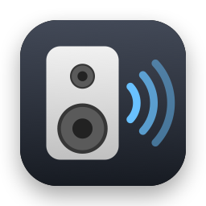
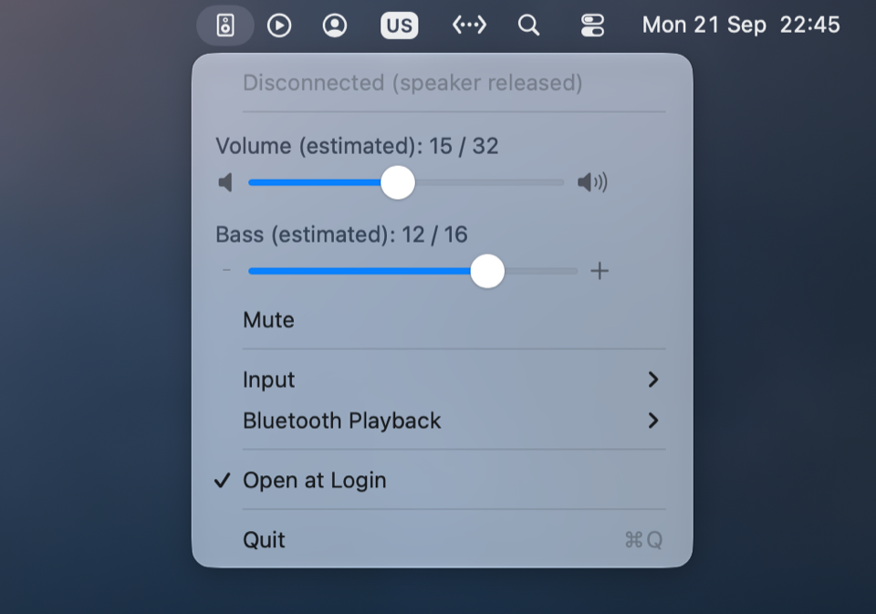

<p align="center">
  
</p>

<h1 align="center">Z407 Volume</h1>

<p align="center">
  Your Mac's volume keys, for Logitech Z407 speakers.<br>
  A menu bar remote over Bluetooth LE: volume, bass, mute, input and playback.
</p>

<p align="center">
  
  <br>
  <sub>Pressing a volume key shows a popup with the level</sub>
</p>

<p align="center">
  
  <br>
  <sub>The menu, with volume and bass sliders</sub>
</p>

## Overview

The volume and mute keys control the Z407 over Bluetooth LE, while audio keeps playing through the monitor's
AUX jack. macOS normally locks the volume keys for digital outputs like that; this app takes them over.

The Z407 accepts one BLE client at a time, so the app connects only while it's in use. It stays disconnected
until you press a key or use the menu. It then connects, sends the commands, keeps the link open for 5 s so
repeated presses go out immediately, and releases the speaker. Another computer, for example on the other side
of a KVM switch, can then connect.

## Download

Releases have a prebuilt universal app (Apple silicon and Intel, macOS 13 or later). Unzip it and move
`Z407Volume.app` to Applications. Every push also produces a build under the Actions tab.

Release builds are signed with the project's own certificate, but they aren't notarized: notarization needs
a paid Apple Developer account. As a result:

- **The first launch is blocked.** macOS says it can't verify the app and only offers **Move to Trash** or
  **Cancel**. Click **Cancel**, open **System Settings › Privacy & Security**, and scroll down to the **Security**
  section. It says Z407Volume was blocked. Click **Open Anyway**, confirm with **Open Anyway**, and authenticate.
  The button only appears for about an hour after the blocked attempt, so open the app again if it's missing.
  If it still doesn't show, run `xattr -dr com.apple.quarantine /Applications/Z407Volume.app` in Terminal and
  open the app normally. Each newly downloaded version needs this once.
- **Accessibility carries over between updates**, because every release is signed with the same certificate.

To avoid the first-launch step, build it yourself (below).

## Build & install

Requires the Xcode Command Line Tools (Swift 6) and macOS 13 or later.

```sh
./setup-signing.sh    # once: stable signing identity, so permissions survive rebuilds
./build.sh            # → build/Z407Volume.app
./build.sh install    # also copies it to ~/Applications
./build.sh run        # install and (re)launch
```

On first launch, macOS asks for two permissions:

1. **Bluetooth.** The app declares `NSBluetoothAlwaysUsageDescription` in `Resources/Info.plist`.
2. **Accessibility**, needed to intercept the keys. Turn on Z407 Volume in System Settings › Privacy & Security ›
   Accessibility, or use the menu's **Open Accessibility Settings…**. Until you do, the menu bar icon shows a ⚠.
   Once access is granted, the app picks it up within about 2 s, without a restart.

Accessibility has no Info.plist usage string, because macOS shows its own prompt. The app is **not
sandboxed**, because macOS doesn't allow sandboxed apps to create an active event tap (one that can swallow
events). As a result, no entitlements are needed.

**Signing:** macOS ties the Accessibility grant to the app's signature. `setup-signing.sh` creates a
self-signed "Z407Volume Local Signing" identity in its own keychain (`~/Library/Keychains/z407-signing.keychain-db`),
and `build.sh` uses it when it's there. Without it, `build.sh` signs ad hoc, and you'll have to re-add the app
under Accessibility after every rebuild. `SIGN_IDENTITY="<name>"` overrides the identity.

Before you enable **Open at Login**, run the app from `~/Applications`.

## Using it

- **Volume keys** step the speaker's volume and show a volume popup in the top-right corner. Held keys repeat. The
  "volume locked" popup macOS normally shows for digital outputs doesn't appear.
- **Mute key** toggles the speaker's mute. Changing the volume unmutes, as it does in macOS. When the speaker's
  input is Bluetooth, the Mute key goes to macOS instead (see [Mute](#mute)).

The menu shows the connection status, the **Volume** and **Bass** sliders, **Mute**, **Input** (Bluetooth / AUX /
USB), **Bluetooth Playback** (play/pause, next, previous), **Open at Login**, and **Quit**. The icons at each
end of a slider step it down or up by one, without closing the menu.

**Option-click** the icon to show the advanced items as well:

| Item | Does |
|---|---|
| Last: … | Most recent event (key press, connect step, error) |
| Re-sync Now | Runs a [sync](#syncing) |
| Intercept Volume Keys | Off hands all keys back to macOS |
| Sync on Startup | Sync when the app starts (default on) |
| Enter Bluetooth Pairing Mode | Makes the speaker discoverable to pair a new Bluetooth audio source |
| Factory Reset Speaker… | Resets the Z407, after a confirmation |
| Copy Diagnostics / Open Log | The event trail, for debugging |

Status is one of: Disconnected (speaker released), Connecting…, Connected, Unreachable (asleep, or held by
another client), Bluetooth off, or Needs Accessibility.

## Levels are estimates

The Z407 accepts only single up/down steps for volume (32 steps) and bass (16 steps). It never reports either
level, and it doesn't report mute (see [below](#reading-the-levels-not-possible)). So the sliders show a count of
the steps this app has sent, saved across restarts. Dragging a slider sends the difference. The estimate drifts
when something else changes the speaker: its dial, the other computer, or the speaker losing power.

### Syncing

A sync steps volume and bass down past zero, the only level that can be known, and then back up to the saved
levels. It takes about 3 s, and presses made during it follow once it finishes. The Mac's levels win, so
anything another client changed is undone. A sync runs at the start of the next session after:

- the app starts, unless **Sync on Startup** is off (it connects straight away);
- the Mac wakes (it connects straight away);
- the speaker was unreachable, because another client held it or it was off (at your next press);
- a sync was cut short (at the next session);
- **Re-sync Now**.

### Mute

No dedicated mute command is known. On AUX and USB, the Z407 treats Play/Pause (`80 04`, the dial's press) as
a mute toggle, and on Bluetooth it's play/pause. The speaker's reply is the same whether the command mutes or
unmutes, and volume steps don't unmute it. So the app tracks mute itself, flipping its state on every
`80 04` it sends off Bluetooth. Pressing the dial desyncs it; toggle **Mute** once to realign. Sync doesn't touch
mute.

## How it works

- **Keys** (`MediaKeyTap.swift`): an active `CGEventTap` at the session level consumes the Sound Up/Down and
  Mute `NX_SYSDEFINED` events, both key-down and key-up, so macOS never acts on them. Only the session on
  screen receives key events, so the app must run in the account you're using.
- **Volume popup** (`VolumeHUD.swift`): a translucent, click-through panel with a speaker icon and a level
  bar. It shows the level the press is heading to, so it moves before the link is up. It can't use the system
  HUD: the private `OSDManager` calls that tools like MonitorControl used still exist on macOS 26+, but
  `OSDUIHelper` no longer shows anything for them.
- **BLE** (`Z407Link.swift`): the app connects directly to the remembered speaker and scans for service `FDC2`
  in parallel, in case the identifier is stale. It subscribes to the response characteristic, then writes the
  handshake `84 05` and `84 00` back to back without waiting for the `d4 05 01` challenge, which saves a round
  trip. Queued commands follow the `d4 00 xx` reply, where `xx` is the current input. Later `d4 05 01`
  keep-alives are answered with `84 00`. A connection takes about 0.3–1 s, and most of that is waiting for
  the speaker's next advertisement. Unanswered attempts give up after 6 s and mark the speaker Unreachable.
  The link is released after 5 idle seconds, before sleep, and on quit.
- **Pacing:** volume and bass steps go out 40 ms apart. The speaker acknowledges steps sent back to back, but
  it doesn't apply them all, which causes audible glitches and drifting sliders. An acknowledgement means the
  step was received, not that it was applied.
- **Protocol** (`Z407Protocol.swift`): commands, responses, and input reports, from
  [freundTech/logi-z407-reverse-engineering](https://github.com/freundTech/logi-z407-reverse-engineering/blob/main/doc/Protocol.md)
  and its [PR #2](https://github.com/freundTech/logi-z407-reverse-engineering/pull/2).

## Settings

Stored in the `io.github.godisemo.z407-volume` defaults domain. The menu covers the usual ones; these are
the tunables:

| Key | Default | Meaning |
|---|---|---|
| `VolumeSteps` | 32 | Volume steps from silent to full |
| `BassSteps` | 16 | Bass steps from minimum to maximum |
| `StepIntervalMs` | 40 | Gap between volume/bass steps; lower is faster, but steps start to get lost |

For example, `defaults write io.github.godisemo.z407-volume StepIntervalMs -int 30`. The app picks up the
change on the next step.

## Sharing with another computer

The speaker has a single control slot, and **the original Logitech dial remote uses it too**. The dial holds
the slot for about 5 minutes after each use, and the app shows Unreachable during that time. Take the
batteries out of the dial if you want this app to be the only remote.

The other computer also has to let go. A client that stays connected (for example, the androrama web app, which
never disconnects) stops the speaker from advertising, and this app will report Unreachable.

## Reading the levels: not possible

`--probe` (`open -n ~/Applications/Z407Volume.app --args --probe [--up N]`) lists the speaker's whole GATT
table and reads everything readable before and after volume steps. It then logs the advertisement. Results on
firmware "ZS283A_develop_ot":

- The only service is `FDC2`. It has two characteristics: command (write) and response (read and notify).
  Reading the response characteristic just returns the last reply.
- Steps are acknowledged with fixed codes (`c0 02`/`c0 03` for volume, `c0 04` for mute in either direction)
  that carry no level. Steps at the floor are still acknowledged, so the app can't detect reaching the bottom.
- The advertisement's manufacturer data (`da 01 16 03 00 00 00 00`) is the same at different volumes.

Prior art, surveyed in September 2026: freundTech's repo and PRs, CoffeeKills/z407-webpuck's PROTOCOL.md, and
about 20 other implementations (web, Android, iOS, macOS, Home Assistant, ESPHome). None of them reads volume
or bass. All of them either estimate the level or show nothing, and none uses a command outside the documented
set.

## Continuous integration

`.github/workflows/build.yml` builds a universal app on every push and pull request, and uploads it as an
artifact. It signs with a self-signed release certificate ("Z407 Volume Release Signing"), stored as the repository
secrets `MACOS_SIGNING_P12` (base64 .p12) and `MACOS_SIGNING_PASSWORD`. The certificate is imported into a
temporary keychain for the build and deleted afterwards. Without the secrets, for example on pull requests from
forks, it signs ad hoc. Pushing a `v*` tag (e.g. `git tag v1.0.0 && git push origin v1.0.0`) also stamps that
version into the app and publishes a GitHub release with the zip.

`build.sh` reads two optional variables for this: `SWIFT_BUILD_FLAGS` (CI passes
`--arch arm64 --arch x86_64`) and `VERSION` (becomes `CFBundleShortVersionString`).

## Developer tools

- `swift scripts/make-icon.swift` redraws the app icon (`Resources/AppIcon.icns`, `docs/icon.png`) from code.

Both probes run as a second instance. The menu app has to be idle or quit first, because the speaker accepts
only one client.

- `--probe [--up N]`: GATT dump and level-readback experiment (above).
- `--speed-probe`: times a pipelined handshake and unpaced bursts of 10 steps. It judges bursts by
  acknowledgements only, so judge the result by ear.

`~/Library/Logs/Z407Volume.log` records every key press, link state change, sync, handshake step, and the raw
bytes written (→) and received (←). The same events go to the unified log under subsystem
`io.github.godisemo.z407-volume`.

## License

MIT, see [LICENSE](LICENSE). The protocol knowledge comes from the community reverse-engineering credited above.

This project is not affiliated with, endorsed by, or connected to Logitech. "Logitech" and "Z407" are
trademarks of Logitech International S.A.
